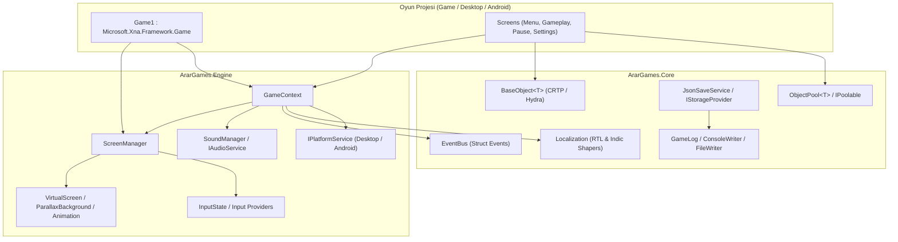

# ArarGames Framework — Genel Bakış

**ArarGames Framework**, 2D ve gelecekteki 3D oyunlar için modern .NET 9.0 ve C# 13 standartlarında geliştirilmiş, performans odaklı, modüler ve iki katmanlı bir oyun motoru / kütüphane ekosistemidir.

ArarGames projelerindeki (PaintTrek, Blocked vb.) mimari standartları konsolide etmek, kod tekrarını önlemek ve çoklu platform desteğini (Windows, Linux, macOS, Android) standartlaştırmak amacıyla tasarlanmıştır.

---

## 🏛️ İki Katmanlı Mimari

ArarGames ekosistemi iki ana paketten oluşur:

```
┌────────────────────────────────────────────────────────┐
│                   ArarGames.Engine                     │
│   (MonoGame / Microsoft.Xna.Framework Bağımlı Katman)   │
│  Screens • Audio • Input • Graphics • Entities • UI    │
└───────────────────────────┬────────────────────────────┘
                            │ Bağımlılık
┌───────────────────────────▼────────────────────────────┐
│                    ArarGames.Core                      │
│        (Saf .NET 9.0 / Platform & Engine Bağımsız)      │
│  Base (CRTP) • Persistence • Localization • Events     │
│             Logging • Validation • Pooling             │
└────────────────────────────────────────────────────────┘
```

### 1. ArarGames.Core (Saf C# / .NET 9.0)
Grafik veya oyun motoru bağımlılığı içermeyen, tamamen taşınabilir altyapı katmanıdır:
- **Base (Hydra Pattern / CRTP)**: `BaseObject<T>`, `IBaseObject<T>`, `IHierarchicalObject<T>` ile Fluent API ve nesne kimlik yönetimi (Guid v7).
- **Persistence (Kayıt Sistemi)**: `ISaveService<TData>`, `IStorageProvider`, `JsonSaveService<TData>` ile atomik dosya yazma, bozuk dosya kurtarma ve dirty-tracking.
- **Events (Olay Veriyolu)**: Sıfır-tahsisat (zero-allocation) odaklı, `struct` tabanlı `EventBus`.
- **Localization (Çoklu Dil)**: `ILocalizationService`, `LanguageCode`, `LanguageInfo`, RTL (Arapça/İbranice/Farsça) ve Indic (Hint/Sinhala) metin şekillendirme motoru.
- **Logging (Günlükleme)**: `GameLog`, `LogType`, `LogCategory` ile renkli konsol ve günlük dosya yazıcısı.
- **Pooling (Nesne Havuzlama)**: `IPoolable`, `ObjectPool<T>` ile çöp toplayıcı (GC) baskısını minimize eden nesne yönetimi.

### 2. ArarGames.Engine (MonoGame Katmanı)
MonoGame (`Microsoft.Xna.Framework`) üzerine inşa edilmiş oyun sistemleri:
- **Screen Management (Ekran Yönetimi)**: `ScreenManager`, `GameScreen`, `IGameScreen`, `GameContext` ile yığın (stack) tabanlı durum yönetimi, geçişler ve modal/overlay ekranlar.
- **Audio (Ses ve Müzik)**: `IAudioService`, `SoundManager`, SFX throttling, dinamik pitch varyansı, müzik crossfade / fade-out ve MGCB bağımsız `RawAssetLoader`.
- **Input (Girdi Sistemi)**: Birleşik `InputState` yapısı, masaüstü (klavye/fare/gamepad) ve mobil (dokunmatik) sağlayıcıları, sanal koordinat eşleme.
- **Graphics (Grafik Araçları)**: `VirtualScreen` (Letterbox/Pillarbox sanal çözünürlük), `Animation` (sprite sheet animatörü), `ParallaxBackground` (sonsuz kayan katmanlar).
- **Entities & UI (Varlıklar ve Arayüz)**: 2D varlık hiyerarşisi, düğmeler, etiketler ve genişletilebilir bileşenler.
- **Platform Abstraction (Platform Soyutlama)**: Masaüstü ve mobil platformlara özgü servisleri (dosya yolu, titreşim, web açma, ekran yönü) soyutlayan `IPlatformService`.

---

## 📊 Mimari Diyagram



---

## 🎯 Tasarım Prensipleri

1. **SOLID ve OOP Standartları**: Tüm bağımlılıklar arayüzler (`ISaveService`, `IAudioService`, `IGameScreen`, `IPlatformService`) üzerinden yönetilir.
2. **Sıfır / Düşük Bellek Tahsisi (Garbage Collection Dostu)**:
   - Olaylar ve girdi durumları `struct` / `readonly struct` olarak tanımlanır.
   - Sık yaratılan ve yok edilen varlıklar için `ObjectPool<T>` kullanılır.
   - Oyun döngüsü (`Update`/`Draw`) içinde LINQ ve dinamik dizi oluşturma çağrılarından kaçınılır.
3. **CRTP (Curiously Recurring Template Pattern) & Fluent API**: Hydra mimarisinden miras alınan `BaseObject<T>` ile tip güvenli metod zincirleme.
4. **Hata Toleransı (Fail-Safe)**: Eksik ses dosyaları oyunu çökertmez; bozuk save dosyaları otomatik olarak `.corrupt` olarak yedeklenip varsayılan duruma sıfırlanır; eksik çeviri anahtarları oyunu durdurmadan İngilizce yedeğe veya ham anahtara düşer.

---

## 💻 Desteklenen Platformlar

| Platform | Grafik Arka Ucu | Proje / Framework |
| :--- | :--- | :--- |
| **Windows** | DirectX 11 / OpenGL (DesktopGL) | .NET 9.0 |
| **Linux** | OpenGL (DesktopGL) | .NET 9.0 |
| **macOS** | Metal / OpenGL (DesktopGL) | .NET 9.0 |
| **Android** | OpenGL ES | .NET 9.0-android (MonoGame.Framework.Android) |

---

## ⚙️ Sistem Gereksinimleri

- **.NET SDK**: 9.0 veya üzeri
- **C# Dili**: C# 13.0
- **MonoGame Framework**: 3.8.4 veya üzeri (`MonoGame.Framework.DesktopGL`, `MonoGame.Framework.Android`)
- **IDE / Editör**: Visual Studio 2022+ / JetBrains Rider / VS Code + C# Dev Kit
