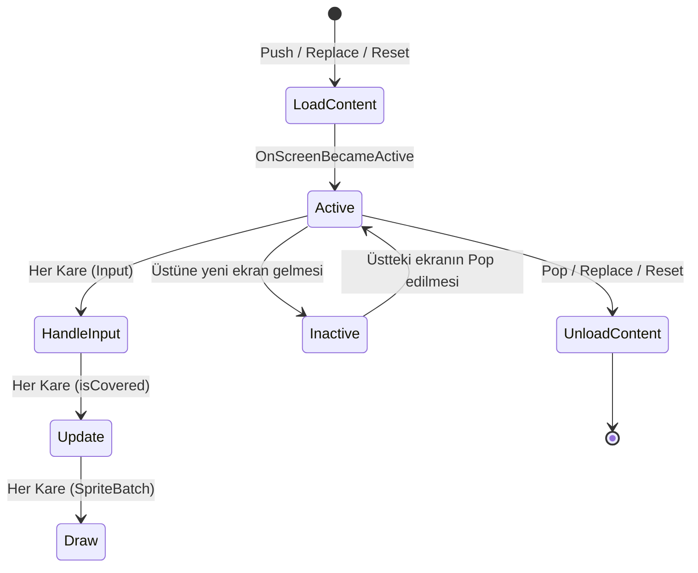

# Ekran Yönetimi (Screen Management)

**ArarGames.Engine.Screens** modülü, oyun durumlarını (Menü, Oyun İçi, Duraklatma/Pause, Seçenekler, Game Over vb.) yığın (stack) tabanlı bir mimari ile yönetir.

Bu modül sayesinde:
- Ekranlar arası geçişler (Push, Pop, Replace, Reset) güvenli ve sıralı biçimde yürütülür.
- Duraklatma menüleri gibi **Overlay (Kaplama)** ekranlar, altlarındaki oyun ekranını dondurup görünür tutabilir.
- Her cihaz çözünürlüğünde sabit kalan **Sanal Çözünürlük (Virtual Resolution)** otomatik ölçeklenir.

---

## 🔄 Ekran Yaşam Döngüsü (Lifecycle)



### `IGameScreen` Arayüzü

`ArarGames.Engine.Screens.IGameScreen` arayüzü, her ekranın uygulaması gereken sözleşmeyi tanımlar:

| Üye | Tür | Açıklama |
| :--- | :--- | :--- |
| `IsOverlay` | `bool` | Ekranın yarı saydam/kaplama olup olmadığını belirtir. |
| `AllowBehindUpdates` | `bool` | Ekran aktifken arkadaki ekranların `Update` alıp almayacağı (örn: Pause menüsünde `false`). |
| `AllowBehindDraw` | `bool` | Ekran aktifken arkadaki ekranların çizilip çizilmeyeceği (örn: Pause menüsünde `true`). |
| `LoadContent()` | `void` | Doku, font ve ses varlıklarının yüklendiği metot. |
| `UnloadContent()` | `void` | Ekran yığından çıktığında kaynakların temizlendiği metot. |
| `Update(GameTime, bool isCovered)` | `void` | Mantıksal durum güncellemesi. `isCovered` üstte başka ekran varsa `true` gelir. |
| `HandleInput(in InputState)` | `void` | Girdi cihazı durumunun işlendiği metot. |
| `Draw(SpriteBatch)` | `void` | Ekranın çizildiği metot. |
| `OnBackPressed()` | `void` | Android geri tuşu veya Escape basıldığında tetiklenir. |
| `OnScreenBecameActive()` | `void` | Ekran en üste gelip aktif olduğunda tetiklenir. |

---

## 🧱 `GameScreen` Temel Sınıfı

Tüm ekranlar `GameScreen` sınıfından türer. Bu sınıf `GameContext` nesnesini saklar ve varsayılan davranışları sağlar:

```csharp
public abstract class GameScreen : IGameScreen
{
    protected readonly GameContext Context;

    public virtual bool IsOverlay { get; protected set; } = false;
    public virtual bool AllowBehindUpdates { get; protected set; } = false;
    public virtual bool AllowBehindDraw { get; protected set; } = true;

    protected GameScreen(GameContext context)
    {
        Context = context ?? throw new ArgumentNullException(nameof(context));
    }

    public virtual void LoadContent() { }
    public virtual void UnloadContent() { }
    public virtual void Update(GameTime gameTime, bool isCovered) { }
    public virtual void HandleInput(in InputState input) { }
    public virtual void Draw(SpriteBatch spriteBatch) { }
    public virtual void OnBackPressed() => Context.Screens.Pop();
    public virtual void OnScreenBecameActive() { }
}
```

---

## 🎛️ `ScreenManager` Operasyonları

`ScreenManager`, ekran geçişlerini ana iş parçacığı güvenliğiyle (`_mainThreadActions` kuyruğu) yönetir. Böylece `Update` veya `HandleInput` çalışırken ekran listesinin bozulması önlenir.

### 1. `Push(IGameScreen screen)`
Yeni ekranı yığının en üstüne ekler.
- **Kullanım Yeri**: Duraklatma menüsü, envanter, popup veya ayarlar ekranı açma.
```csharp
Context.Screens.Push(new PauseScreen(Context));
```

### 2. `Pop()`
En üstteki ekranı kapatır, `UnloadContent()` çağırır ve bir alttaki ekranı aktif eder.
- **Kullanım Yeri**: Geri dönme, duraklatma menüsünden oyuna devam etme.
```csharp
Context.Screens.Pop();
```

### 3. `Replace(IGameScreen screen)`
En üstteki ekranı kaldırıp yerine yeni ekran koyar.
- **Kullanım Yeri**: Ana Menüden Oyun İçi ekrana geçiş.
```csharp
Context.Screens.Replace(new GameplayScreen(Context));
```

### 4. `Reset(IGameScreen screen)`
Yığındaki TÜM ekranları boşaltır ve verilen ekranı tek ekran olarak ekler.
- **Kullanım Yeri**: Oyundan çıkıp Ana Menüye dönme veya Game Over sonrası sıfırlama.
```csharp
Context.Screens.Reset(new MainMenuScreen(Context));
```

---

## 🖥️ Sanal Çözünürlük ve Ölçekleme

ArarGames, sabit bir sanal çözünürlükte (örn. 1280x720) çizim yapmanıza olanak tanır. `ScreenManager.CalculateMatrix`, hedef pencerenin en-boy oranına göre **Letterbox** (üst-alt siyah bant) veya **Pillarbox** (sağ-sol siyah bant) hesaplar.

```csharp
// Game1.cs Draw metodu içinde:
_screenManager.CalculateMatrix(GraphicsDevice);
GraphicsDevice.Clear(Color.Black);

_spriteBatch.Begin(
    SpriteSortMode.Deferred,
    BlendState.AlphaBlend,
    SamplerState.PointClamp,
    null,
    null,
    null,
    _screenManager.GlobalScaleMatrix
);

_screenManager.Draw(_spriteBatch);
_spriteBatch.End();
```

Fiziksel fare veya dokunmatik koordinatları sanal koordinatlara dönüştürmek için:
```csharp
Vector2 virtualMouse = _screenManager.ScreenToVirtual(new Vector2(mouseState.X, mouseState.Y));
```

---

## 🌟 Örnek Senaryo: Menü, Oyun ve Duraklatma Ekranı

### 1. `MainMenuScreen`
```csharp
public class MainMenuScreen : GameScreen
{
    public MainMenuScreen(GameContext context) : base(context) { }

    public override void HandleInput(in InputState input)
    {
        if (input.ConfirmJustPressed || input.FireJustPressed)
        {
            Context.Screens.Replace(new GameplayScreen(Context));
        }
    }

    public override void Draw(SpriteBatch spriteBatch)
    {
        // Draw Menu Title & "Press Enter to Start"
    }
}
```

### 2. `GameplayScreen`
```csharp
public class GameplayScreen : GameScreen
{
    public GameplayScreen(GameContext context) : base(context) { }

    public override void HandleInput(in InputState input)
    {
        if (input.PauseJustPressed || input.BackJustPressed)
        {
            // Open Pause Screen as an Overlay
            Context.Screens.Push(new PauseScreen(Context));
            return;
        }

        // Handle Player movement & shooting
    }

    public override void Update(GameTime gameTime, bool isCovered)
    {
        // When PauseScreen is active, isCovered will be true if AllowBehindUpdates was true
        // But since PauseScreen has AllowBehindUpdates = false, this Update won't even run!
        // All game entities remain paused safely.
    }

    public override void Draw(SpriteBatch spriteBatch)
    {
        // Draw Level, Enemies, Player
    }
}
```

### 3. `PauseScreen` (Overlay / Kaplama Ekranı)
```csharp
public class PauseScreen : GameScreen
{
    private Texture2D _dimTexture = null!;

    public PauseScreen(GameContext context) : base(context)
    {
        IsOverlay = true;
        AllowBehindUpdates = false; // Freeze gameplay behind
        AllowBehindDraw = true;     // Still render the gameplay underneath
    }

    public override void LoadContent()
    {
        // Create a 1x1 black texture for dimming the background
        _dimTexture = new Texture2D(Context.GraphicsDevice, 1, 1);
        _dimTexture.SetData(new[] { Color.Black });
    }

    public override void HandleInput(in InputState input)
    {
        // Resume game on Pause or Back
        if (input.PauseJustPressed || input.BackJustPressed)
        {
            Context.Screens.Pop(); // Returns back to GameplayScreen
        }

        // Return to Main Menu on Escape/Confirm
        if (input.ConfirmJustPressed)
        {
            Context.Screens.Reset(new MainMenuScreen(Context));
        }
    }

    public override void Draw(SpriteBatch spriteBatch)
    {
        // 1. Draw semi-transparent dark overlay
        spriteBatch.Draw(_dimTexture, new Rectangle(0, 0, Context.Screens.VirtualWidth, Context.Screens.VirtualHeight), Color.Black * 0.6f);

        // 2. Draw "PAUSED" text and options
    }
}
```
