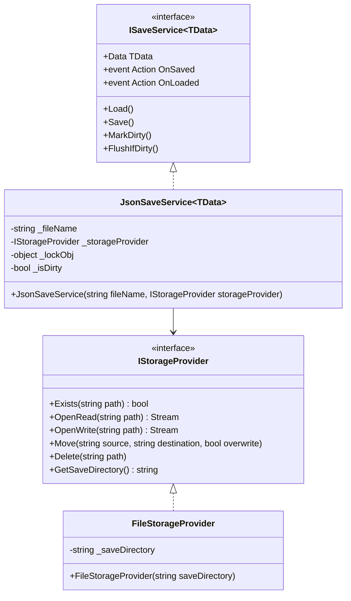

# Kayıt ve Yükleme Sistemi (Persistence)

**ArarGames.Core.Persistence** modülü, oyun ayarları ve ilerleme verilerinin JSON formatında güvenli, atomik ve bozulmaya karşı dirençli (fail-safe) olarak kaydedilmesini ve yüklenmesini sağlar.

---

## 🏗️ Mimari ve Temel Bileşenler

Sistem, I/O işlemlerini depolama mantığından ayıran iki temel arayüz üzerine kuruludur:



---

## 🔒 Güvenilirlik Özellikleri

### 1. Atomik Yazma (Atomic Write)
Oyun sırasında elektrik kesintisi, pil bitmesi veya ani kapanma yaşandığında mevcut save dosyasının bozulmaması için veriler doğrudan asıl dosyaya yazılmaz:
1. Veriler önce geçici bir `save.json.tmp` dosyasına serileştirilir.
2. Yazma işlemi başarıyla tamamlandıktan sonra `_storageProvider.Move(tempFileName, fileName, overwrite: true)` ile anlık olarak hedef dosyanın üzerine yazılır.
3. Böylece diskte hiçbir zaman yarım veya bozuk bir dosya kalmaz.

### 2. Bozuk Dosya Kurtarma (Corruption Recovery)
Kullanıcı veya üçüncü parti bir yazılım save dosyasını bozarsa ya da JSON formatı geçersiz hale gelirse:
1. `JsonSaveService`, `JsonException` yakalar ve `GameLog.Error` ile hata kaydı düşer.
2. Bozuk dosya `save.json.corrupt` olarak kopyalanır (analiz veya inceleme için saklanır).
3. Oyuncu için temiz bir `new TData()` örneği oluşturulur ve oyunun kilitlenmesi/çökmesi engellenir.

### 3. Dirty Tracking (Gereksiz I/O Tasarrufu)
Disk yazma işlemleri maliyetlidir (özellikle mobil cihazlarda flaş bellek ömrü ve pil tüketimi açısından).
- `MarkDirty()`: Veride değişiklik yapıldığında çağrılır.
- `FlushIfDirty()`: Yalnızca değişiklik varsa diske yazar. Her karede veya periyodik zamanlayıcıda güvenle çağrılabilir.

---

## 💻 Kullanım Örneği

### 1. Kayıt Veri Modeli (`GameSaveData.cs`)
```csharp
using System;
using System.Collections.Generic;

namespace MyGame.Models;

/// <summary>
/// Represents the serializable save data structure.
/// </summary>
public class GameSaveData
{
    public int HighScore { get; set; } = 0;
    public int TotalCoins { get; set; } = 0;
    public int CurrentLevel { get; set; } = 1;
    public float MusicVolume { get; set; } = 1.0f;
    public float SfxVolume { get; set; } = 1.0f;
    public string SelectedLanguage { get; set; } = "en";
    public List<string> UnlockedSkins { get; set; } = new() { "Default" };
    public DateTime LastPlayedUtc { get; set; } = DateTime.UtcNow;
}
```

### 2. Servisin Başlatılması ve Kullanımı
```csharp
using System;
using System.IO;
using ArarGames.Core.Persistence;
using MyGame.Models;

public class SaveManager
{
    private readonly ISaveService<GameSaveData> _saveService;

    public GameSaveData Data => _saveService.Data;

    public SaveManager(string saveDirectory)
    {
        // 1. Storage provider oluştur (Masaüstü veya mobil dizini)
        IStorageProvider storage = new FileStorageProvider(saveDirectory);

        // 2. JsonSaveService başlat
        _saveService = new JsonSaveService<GameSaveData>("savegame.json", storage);

        // 3. Olayları dinle (opsiyonel)
        _saveService.OnSaved += () => Console.WriteLine("Save completed successfully.");
        _saveService.OnLoaded += () => Console.WriteLine("Save loaded successfully.");

        // 4. Verileri yükle
        _saveService.Load();
    }

    public void AddCoins(int amount)
    {
        _saveService.Data.TotalCoins += amount;
        _saveService.MarkDirty(); // Veri değişti olarak işaretle
    }

    public void UpdateHighScore(int score)
    {
        if (score > _saveService.Data.HighScore)
        {
            _saveService.Data.HighScore = score;
            _saveService.MarkDirty();
        }
    }

    public void SaveNow()
    {
        _saveService.Data.LastPlayedUtc = DateTime.UtcNow;
        _saveService.Save(); // Doğrudan kaydet
    }

    public void PeriodicTick()
    {
        // Yalnızca değişiklik varsa diske yazar
        _saveService.FlushIfDirty();
    }
}
```

---

## 🛠️ Depolama Dizinleri (Platform Uyumluluğu)

Farklı platformlar için `saveDirectory` şu şekilde belirlenmelidir:

| Platform | Önerilen Dizin |
| :--- | :--- |
| **Windows Desktop** | `Path.Combine(Environment.GetFolderPath(Environment.SpecialFolder.ApplicationData), "MyGame")` |
| **Linux / macOS** | `Path.Combine(Environment.GetFolderPath(Environment.SpecialFolder.UserProfile), ".mygame")` |
| **Android** | `Android.App.Application.Context.FilesDir.AbsolutePath` |
