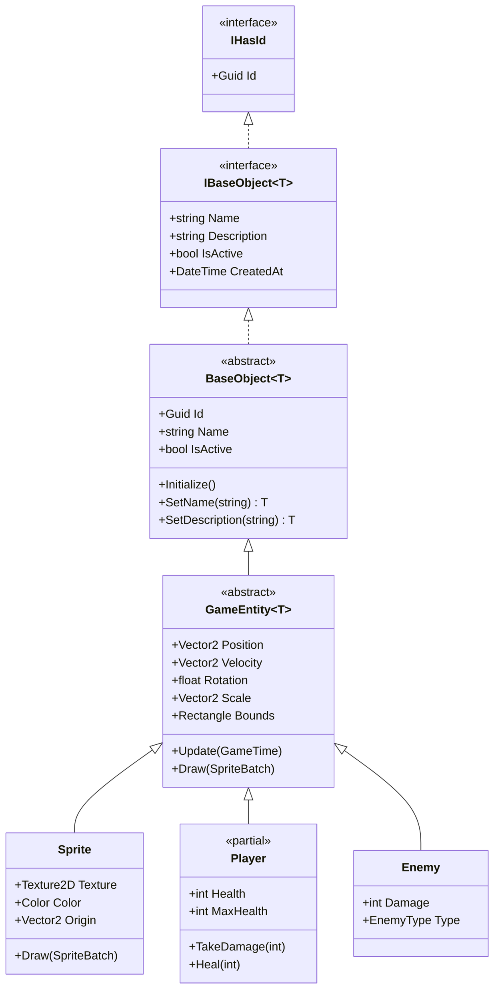

# Oyun Varlıkları ve Oyuncu Mimarisi (Entities & Player)

ArarGames varlık mimarisi, yüksek performanslı nesne yönelimli programlama, **CRTP (Curiously Recurring Template Pattern)** ve Hydra tasarım desenlerini birleştirir.

---

## 🏛️ Varlık Hiyerarşisi



---

## 🧬 `BaseObject<T>` ve CRTP (Hydra Pattern)

`BaseObject<T>`, tüm iş ve oyun nesnelerinin temelini oluşturur:
- **CRTP (Curiously Recurring Template Pattern)**: Alt sınıfların kendi tiplerini generic argüman olarak geçmesini sağlar.
- **Fluent API**: Metod zincirleme (`entity.SetName("Hero").SetDescription("...")`) dönüş tipini kaybetmeden çalışır.
- **Guid Version 7**: Zamana göre sıralanabilir, ultra yüksek performanslı 128-bit benzersiz kimlik ataması yapar (`Guid.CreateVersion7()`).

```csharp
public abstract class BaseObject<T> : IBaseObject<T> where T : BaseObject<T>
{
    public Guid Id { get; set; }
    public string? Name { get; set; }
    public string? Description { get; set; }
    public bool IsActive { get; set; } = true;
    public DateTime CreatedAt { get; set; }
    public DateTime? ModifiedAt { get; set; }
    public bool IsPersistent { get; set; }

    public virtual void Initialize()
    {
        Id = Guid.CreateVersion7();
        CreatedAt = DateTime.UtcNow;
    }

    public T SetName(string name)
    {
        Name = name;
        return (T)this;
    }
}
```

---

## 🚀 `GameEntity<T>` (2D Oyun Varlığı)

2D koordinat sistemi, hız, dönme ve çarpışma sınırlarını barındıran temel sınıftır:

```csharp
using Microsoft.Xna.Framework;
using Microsoft.Xna.Framework.Graphics;
using ArarGames.Core.Base;

namespace ArarGames.Engine.Entities;

public abstract class GameEntity<T> : BaseObject<T> where T : GameEntity<T>
{
    public Vector2 Position { get; set; }
    public Vector2 Velocity { get; set; }
    public float Rotation { get; set; }
    public Vector2 Scale { get; set; } = Vector2.One;
    public Color Color { get; set; } = Color.White;
    public int Width { get; set; }
    public int Height { get; set; }

    public virtual Rectangle Bounds => new(
        (int)(Position.X - (Width * Scale.X) / 2),
        (int)(Position.Y - (Height * Scale.Y) / 2),
        (int)(Width * Scale.X),
        (int)(Height * Scale.Y)
    );

    public virtual void Update(GameTime gameTime)
    {
        float dt = (float)gameTime.ElapsedGameTime.TotalSeconds;
        Position += Velocity * dt;
    }

    public abstract void Draw(SpriteBatch spriteBatch);
}
```

---

## 🛡️ `Player` Sınıfı ve `partial class` Mimarisi

Oyuncu sınıfı temel can, hasar alma ve iyileşme mekaniklerini içerir. `partial class` olarak tasarlandığı için oyun projeniz ek dosyalarla sınıfı genişletebilir:

### Çekirdek Oyuncu Sınıfı:
```csharp
namespace ArarGames.Engine.Entities;

public partial class Player : GameEntity<Player>
{
    public int Health { get; protected set; } = 100;
    public int MaxHealth { get; protected set; } = 100;
    public bool IsDead => Health <= 0;

    public virtual void TakeDamage(int amount)
    {
        if (IsDead || amount <= 0) return;

        Health = Math.Max(0, Health - amount);
        OnDamaged(amount);

        if (IsDead)
        {
            OnKilled();
        }
    }

    public virtual void Heal(int amount)
    {
        if (IsDead || amount <= 0) return;
        Health = Math.Min(MaxHealth, Health + amount);
    }

    partial void OnDamaged(int amount);
    partial void OnKilled();
}
```

### Projeye Özel Genişletme (`Player.Upgrades.cs`):
```csharp
namespace ArarGames.Engine.Entities;

public partial class Player
{
    public int Shield { get; set; } = 50;
    public int Level { get; set; } = 1;

    partial void OnDamaged(int amount)
    {
        // Hasar alındığında ekrana sarsıntı efekti veya kırmızı flaş ver
    }

    partial void OnKilled()
    {
        // Game Over olayını tetikle
    }
}
```

---

## 👾 Örnek: Özel Düşman Varlığı (`Enemy`)

```csharp
public class Enemy : GameEntity<Enemy>
{
    private readonly Texture2D _texture;
    public int Damage { get; set; } = 15;
    public int ScoreReward { get; set; } = 100;

    public Enemy(Texture2D texture)
    {
        _texture = texture;
        Width = texture.Width;
        Height = texture.Height;
        Initialize(); // Guid v7 ve CreatedAt atar
    }

    public override void Update(GameTime gameTime)
    {
        base.Update(gameTime); // Position += Velocity * dt

        // Ekran dışına çıkma kontrolü veya yapay zeka
    }

    public override void Draw(SpriteBatch spriteBatch)
    {
        Vector2 origin = new Vector2(_texture.Width / 2f, _texture.Height / 2f);
        spriteBatch.Draw(_texture, Position, null, Color, Rotation, origin, Scale, SpriteEffects.None, 0f);
    }
}
```
