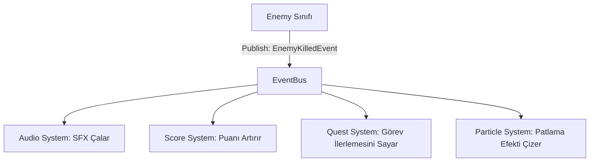

# Olay Sistemi (Event System & EventBus)

**ArarGames.Core.Events** modülü, oyun sistemleri arasındaki sıkı bağımlılıkları (tight coupling) ortadan kaldırmak için **sıfır-tahsisatlı (zero-allocation)**, `struct` tabanlı hafif bir olay veriyolu (`EventBus`) sunar.

---

## 🎯 Neden `struct` Tabanlı EventBus?

Geleneksel C# olay veriyolları veya `object` alan sistemler:
- Her olay yayınlandığında heap üzerinde yeni bir nesne yaratır (`new`).
- Olay verilerini `object`'e çevirirken **Boxing / Unboxing** cezasına yol açar.
- Saniyede yüzlerce mermi, patlama ve skor olayının gerçekleştiği 60 FPS oyun döngülerinde Garbage Collector (GC) duraklamalarına neden olur.

**ArarGames EventBus**:
- Olay veri yapılarını `where T : struct` kısıtı ile zorunlu kılar.
- `Publish<T>(in T eventData)` ile verileri kopyalamadan (`readonly ref`) işler.
- Sıfır heap tahsisatı ile maksimum performans sağlar.

---

## ⚙️ `EventBus` Sınıfı

```csharp
public class EventBus
{
    private readonly Dictionary<Type, List<Delegate>> _handlers = new();

    /// <summary>Belirtilen struct olay tipine abone olur.</summary>
    public void Subscribe<T>(Action<T> handler) where T : struct;

    /// <summary>Belirtilen aboneliği kaldırır.</summary>
    public void Unsubscribe<T>(Action<T> handler) where T : struct;

    /// <summary>Olayı tüm dinleyicilere yayınlar.</summary>
    public void Publish<T>(in T eventData) where T : struct;

    /// <summary>Tüm abonelikleri temizler.</summary>
    public void ClearAll();
}
```

---

## 📦 Olay Tanımlama (Event Definitions)

Olaylar sadece veri taşıyan `readonly struct` veya `record struct` olarak tanımlanır:

```csharp
namespace MyGame.Events;

public readonly record struct EnemyKilledEvent(
    Guid EnemyId, 
    string EnemyType, 
    int ScoreValue, 
    Vector2 Position
);

public readonly record struct ScoreChangedEvent(
    int OldScore, 
    int NewScore
);

public readonly record struct PlayerHealthChangedEvent(
    int CurrentHealth, 
    int MaxHealth
);
```

---

## 🔗 Gevşek Bağlama (Loose Coupling) Örneği

Aşağıdaki mimaride, düşman öldüğünde Düşman sınıfı; Ses, Görev (Quest), Arayüz (UI) veya Parçacık sistemlerinin hiçbirini doğrudan tanımaz. Sadece `EnemyKilledEvent` yayınlar.



### 1. Düşman Sınıfı (Yayıncı / Publisher)
```csharp
public class Enemy : GameEntity<Enemy>
{
    private readonly GameContext _context;
    public int ScoreReward { get; set; } = 100;

    public void Die()
    {
        IsActive = false;

        // Olayı yayınla
        _context.Events.Publish(new EnemyKilledEvent(
            EnemyId: Id,
            EnemyType: "FighterJet",
            ScoreValue: ScoreReward,
            Position: Position
        ));
    }
}
```

### 2. Arayüz ve Skor Sistemi (Abone / Subscriber)
```csharp
public class GameplayHud : GameScreen
{
    private int _score;

    public GameplayHud(GameContext context) : base(context)
    {
    }

    public override void LoadContent()
    {
        // Olaylara abone ol
        Context.Events.Subscribe<ScoreChangedEvent>(OnScoreChanged);
        Context.Events.Subscribe<PlayerHealthChangedEvent>(OnHealthChanged);
    }

    public override void UnloadContent()
    {
        // Bellek sızıntısını önlemek için ekran kapanırken abonelikten çık
        Context.Events.Unsubscribe<ScoreChangedEvent>(OnScoreChanged);
        Context.Events.Unsubscribe<PlayerHealthChangedEvent>(OnHealthChanged);
    }

    private void OnScoreChanged(ScoreChangedEvent e)
    {
        _score = e.NewScore;
    }

    private void OnHealthChanged(PlayerHealthChangedEvent e)
    {
        // Can barını güncelle
    }
}
```

---

## ⚠️ En İyi Pratikler (Best Practices)

1. **Abonelik Temizliği**: Ekranlar veya geçici nesneler yok edilirken (`UnloadContent` veya `Dispose`) aboneliklerini `Unsubscribe` ile kaldırmalıdır. Aksi halde eski ekran referansı bellekte kalabilir.
2. **Olay İçinde Ağır İşlerden Kaçınma**: `Publish` çağrısı aboneleri senkron olarak çalıştırır. Bir olay dinleyicisi içinde dosya kaydetme veya uzun süren döngüler çalıştırmaktan kaçının.
